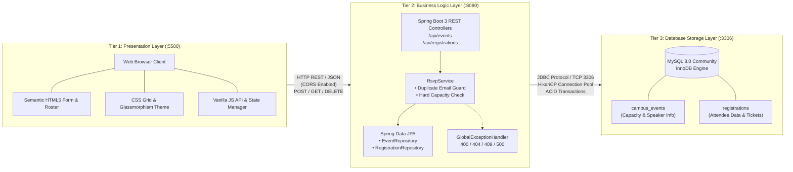
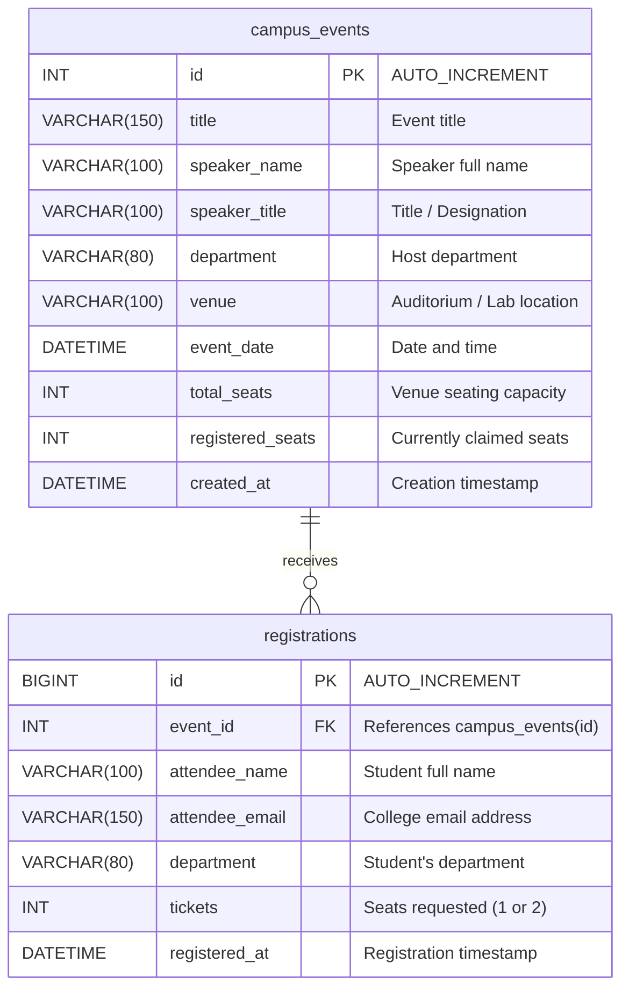
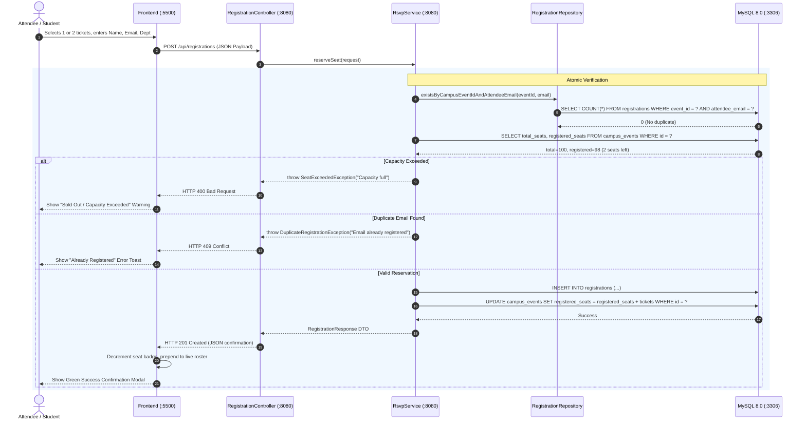
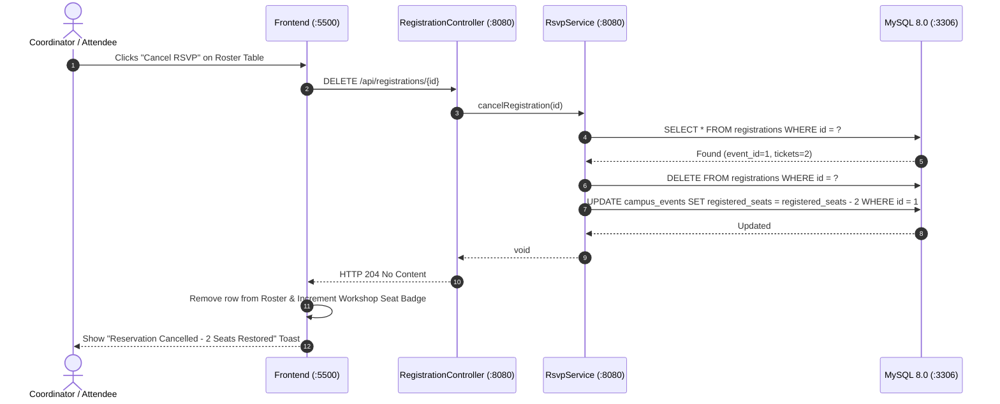

# Phase 2: 3-Tier Architecture & Database Schema Design
## Campus AI Workshop & Hackathon RSVP Portal

This document outlines the **3-Tier Architecture** (`Port 5500` &rarr; `Port 8080` &rarr; `Port 3306`), communication protocols, relational database schema, data integrity invariants, and end-to-end sequence flows.

---

## 1. 3-Tier Architecture Diagram (5500 &rarr; 8080 &rarr; 3306)



### Layer Breakdown & Responsibilities

| Tier | Component | Port | Technology | Primary Responsibilities |
| :--- | :--- | :--- | :--- | :--- |
| **Tier 1: Presentation** | Frontend Client | `5500` | Semantic HTML5, CSS Grid, Vanilla JS | Form validation, real-time seat headroom display, ticket selector (1-2), live roster rendering, user feedback toasts. |
| **Tier 2: Application** | Backend REST API | `8080` | Java 17, Spring Boot 3, Spring Data JPA | Enforces duplicate email detection, validates ticket limits (1-2), performs atomic capacity increments, serves REST endpoints. |
| **Tier 3: Persistence** | Database Engine | `3306` | MySQL 8.0 Server (InnoDB) | Enforces unique email per workshop constraint (`uk_event_email`), foreign keys, transactional atomicity, persistent storage. |

---

## 2. Relational Database Schema Design (MySQL 8.0)



### Constraints & Invariants

1. **Duplicate Email Prevention**:
   ```sql
   UNIQUE KEY uk_event_email (event_id, attendee_email)
   ```
   *Guarantees a student can never register twice for the same workshop, preventing slot hoarding.*

2. **Ticket Allocation Bounds**:
   ```sql
   CONSTRAINT chk_ticket_count CHECK (tickets IN (1, 2))
   ```
   *Restricts reservations to either single (1) or pair (2) tickets.*

3. **Capacity Invariant**:
   ```sql
   CONSTRAINT chk_capacity CHECK (registered_seats <= total_seats)
   ```
   *Guarantees venue capacity is never exceeded at the database level.*

4. **Foreign Key Integrity**:
   ```sql
   FOREIGN KEY (event_id) REFERENCES campus_events(id) ON DELETE RESTRICT ON UPDATE CASCADE
   ```
   *Preserves data integrity between registrations and their target event.*

---

## 3. Sequence Flows

### Flow A: Reservation Submission (`POST /api/registrations`)



### Flow B: Cancellation & Seat Restoration (`DELETE /api/registrations/{id}`)


